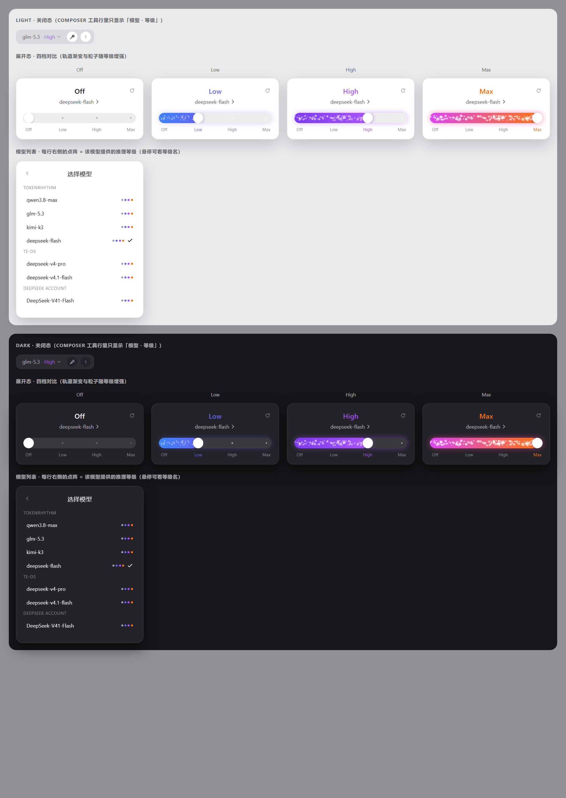

# dsh-thinking-slider

把 DeepSeek Harness（DSH）composer 里的**模型选择器**换成「模型 + 推理强度」：
平时显示 `模型名 · 等级`，点开是一张卡片 —— 上面是模型列表入口，下面是带**渐变与粒子**的强度滑块。

*An opinionated model + reasoning-effort picker for the DSH composer, with a gradient particle rail.*



## 它做什么

- **关闭态**：正常的一行文字 `deepseek-flash · Max`，不占地方
- **点开**：卡片里大字显示当前等级，`模型名 ›` 可切模型，下面一条厚滑块
- **拖滑块**：即时切换推理强度；轨道渐变、光晕、粒子密度随等级上升
- **键盘**：`←/→`、`Home/End` 切换，`Esc` 关闭
- **降级**：模型没有推理等级时只显示模型名，不出现滑块（不会给你一个假的控件）

等级**不写死在插件里** —— 它读 DSH 上报的 `model.reasoning.efforts`，
所以任何在配置里声明了 `reasoningEfforts` 的供应商路由都会自动出现在滑块上。

## 要求

- DSH Desktop 或 `dsh web`，内核 **0.2.x**（开发时验证于 `0.2.0-rc.1` / `0.2.0-rc.2`）
- 无第三方依赖：只用 DSH 自带的 `react` / `react/jsx-runtime` / `react-dom`

插件**没有声明 `peerDependencies`**，所以不会被 DSH 的版本门禁整包跳过；
代价是版本兼容由你自己判断，升级 DSH 后如果 UI 槽位变了可能失效。

## 安装

```bash
dsh plugin --profile desktop add github:MuFeng262/dsh-thinking-slider
```

装完**完全退出 DSH Desktop 再打开**（客户端插件在启动时组合加载）。

> 如果你的 profile 名不是 `desktop`，把 `--profile desktop` 换成实际名字。
> 插件管理器里添加同一条 `github:MuFeng262/dsh-thinking-slider` 也可以。

<details>
<summary>手动安装（命令不可用时）</summary>

1. 克隆到插件源码目录：

   ```bash
   git clone https://github.com/MuFeng262/dsh-thinking-slider %USERPROFILE%\.dsh\plugins-src\dsh-thinking-slider
   ```

2. 把 `node_modules\dsh-thinking-slider` 做成指向它的**目录联结（junction）**：

   ```powershell
   New-Item -ItemType Junction `
     -Path "$env:USERPROFILE\.dsh\profiles\desktop\node_modules\dsh-thinking-slider" `
     -Target "$env:USERPROFILE\.dsh\plugins-src\dsh-thinking-slider"
   ```

3. 在 `%USERPROFILE%\.dsh\profiles\desktop\package.json` 里加两处：

   ```jsonc
   {
     "dependencies": {
       "dsh-thinking-slider": "file:../../plugins-src/dsh-thinking-slider"
     },
     "dsh": {
       "profile": {
         "bundles": [
           "dsh-thinking-slider"        // ← 加进这个数组
         ]
       }
     }
   }
   ```

4. 重启 DSH Desktop。
</details>

## 让自定义模型也有推理等级

**档位不在插件里。** 插件是通用的，但 `Off / Low / High / Max` 来自你自己的 profile 配置。
DSH 的 Models 设置页**刻意不提供**这个字段，只能手写进 profile 的 `cordis.patch.yml`：

```yaml
- id: llm-pi-ai
  name: "@deepseek-ai/dsh-llm-pi-ai"
  config:
    providers:
      your-gateway:
        displayName: 你的中转商
        apiKeyEnv: YOUR_API_KEY
        api: openai-completions
        baseURL: https://your-gateway.example/v1
        models:
          - id: some-model
            name: some-model
            reasoningEfforts:      # ← 关键：每个模型单独写
              off: none
              low: low
              high: high
              max: max
```

几点注意：

- 右边那些值是**原样发到网关的拼写**，不是 DSH 的枚举。不同中转商认的词不一样，
  填错可能 400 —— 建议先只给一个模型加上试。
- 键名（`off` / `minimal` / `low` / `medium` / `high` / `xhigh` / `max`）决定了滑块上有几档。
- 省略 `reasoningEfforts` 时，DSH 只会按**模型 id** 去查内置目录；
  自定义模型名查不到 → 该模型就没有等级。
- `reasoningEfforts: false` 可以显式声明为「非推理模型」。

## 卸载

```bash
dsh plugin --profile desktop remove dsh-thinking-slider
```

手动装的，要删三处：`node_modules\dsh-thinking-slider`、
`package.json` 的 `dependencies` 条目、以及 `dsh.profile.bundles` 里的同名项。
**只删 dependencies 不够** —— bundles 里的条目不清掉，插件开机仍会被加载。

## 开发

```bash
git clone https://github.com/MuFeng262/dsh-thinking-slider
cd dsh-thinking-slider
node test/smoke.mjs      # 66 项行为测试，零依赖，不需要 DSH
```

`test/smoke.mjs` 自带一个迷你 React 运行时（hooks 槽位、类组件与错误边界、
跨渲染的 DOM 节点身份、真实执行的 effect 与 cleanup），所以
「节点重挂后动画有没有重新绑定」这类问题是可以断言的，不需要开浏览器。

## 许可

MIT
